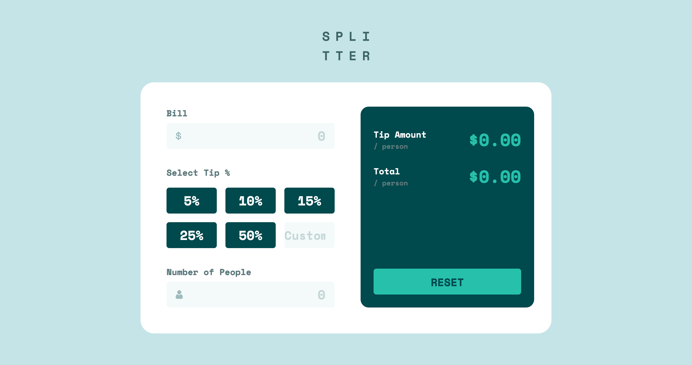

# Frontend Mentor - Tip calculator app solution

This is a solution to the [Tip calculator app challenge on Frontend Mentor](https://www.frontendmentor.io/challenges/tip-calculator-app-ugJNGbJUX). Frontend Mentor challenges help you improve your coding skills by building realistic projects.

## Table of contents

-   [概要](#概要)
    -   [チャレンジ](#チャレンジ)
    -   [スクリーンショット](#スクリーンショット)
    -   [リンク](#リンク)
-   [プロセス](#プロセス)
    -   [使用したスキル](#使用したスキル)

## 概要

### チャレンジ

ユーザーができること:

-   ユーザーの画面サイズによって最適なレイアウトが表示される
-   ページ上の全てのインタラクティブな要素にホバー状態を見ることができる
-   1 人当たりの正しいチップ額と合計額を計算できる

### スクリーンショット

### リンク

-   Live Site URL: [リンク](https://your-live-site-url.com)

## プロセス

### 使用したスキル

-   CSS custom properties
-   Flexbox
-   CSS Grid
-   モバイルファースト
-   Vanilla JavaScript
